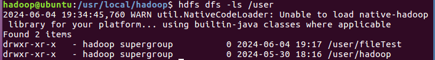
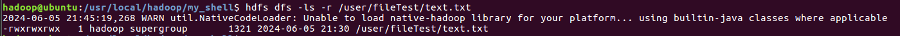
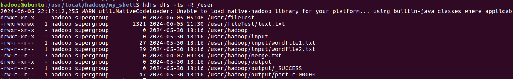
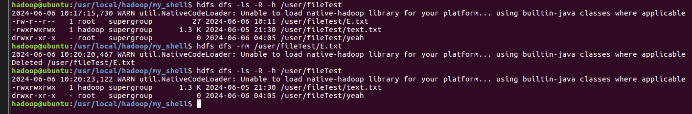

# HDFS_shell

## 先开Hadoop

```shell
cd /usr/local/hadoop
./sbin/start-dfs.sh
```

---

## 创建一个文件

```shell
vim text.txt
```

按`i`输入, 之后按`ESC`退出编辑, 再之后输入`:wq`并`回车`保存并退出

---

## 在HDFS中创建一个文件夹

```shell
hdfs dfs -mkdir -p /user/fileTest
```

之后输入`hdfs dfs -ls /user`来查看是否创建成功



---

## 解除文件权限限制

输入`hdfs dfs -chmod -R 777 /user/fileTest`

---

## 在本地新建一个文件夹用来存shell脚本


```shell
mkdir my_shell
```

---

## `(1)`上传文件到HDFS, 如果存在,由用户指定追加还是覆盖

首先进入刚才的文件夹

```shell
cd my_shell
```

创建一个shell脚本

```shell
vim one.sh
```

进入之后输入如下内容

```bash
#!/bin/bash
export JAVA_HOME=/usr/lib/jvm/jdk1.8.0_162
export JRE_HOME=${JAVA_HOME}/jre
export CLASSPATH=.:${JAVA_HOME}/lib:${JRE_HOME}/lib
export PATH=${JAVA_HOME}/bin:$PATH
export PATH=$PATH:/usr/local/hadoop/bin:/usr/local/hadoop/sbin
my_dir="/user/fileTest/"
my_d="/usr/local/hadoop/"
read -p "input your file name: " my_file
if hdfs dfs -test -e "$my_dir/$my_file"; then
    echo "file already exists, what do you want to do: "
    read -p  "add/cover (a/c)" user_input
    if [ "$user_input" -eq "a" ]; then
        hdfs dfs -appendToFile "$my_d$my_file" "$my_dir$my_file"
        echo "add success"
    else
        hdfs dfs -copyFromLocal -f "$my_d$my_file" "$my_dir$my_file"
        echo "cover success"
    fi
else
    hdfs dfs -put "$my_d$my_file" "$my_dir"
    echo "put success"
fi
```

### 流程


1. 输入`sudo bash one.sh`

2. 按照提示输入文件名`text.txt`

3. 如果是第一次上传,则会直接上传,否则按照提示选择追加还是覆写

4. 操作两遍,把功能都试一下

**注意**:`text.txt`里面要写点东西,否则不显示内容

### 实机演示

<video controls src="one-1.mp4" title="Title"></video>


---

## `(2)`从HDFS上下载文件到本地,如果重名则重命名再下载

首先还是创建一个shell文件

```shell
vim two.sh
```

直接开始写代码

```bash
#!/bin/bash
export JAVA_HOME=/usr/lib/jvm/jdk1.8.0_162
export JRE_HOME=${JAVA_HOME}/jre
export CLASSPATH=.:${JAVA_HOME}/lib:${JRE_HOME}/lib
export PATH=${JAVA_HOME}/bin:$PATH
export PATH=$PATH:/usr/local/hadoop/bin:/usr/local/hadoop/sbin
my_dir="/user/fileTest/"
my_local_dir="/usr/local/hadoop/"
hdfs dfs -ls /user/fileTest
echo " "
read -p "input the file you want: " my_file
if [ -f "/usr/local/hadoop/$my_file" ]; then
    echo "file is in here, to be remaned"
    my_file_name=$(echo "$my_file" | cut -d '.' -f 1)
    num=1
    while true; do
        if ! [ -f "/usr/local/hadoop/${my_file_name}_${num}.txt" ]; then
            hdfs dfs -get "/user/fileTest/$my_file" "/usr/local/hadoop/${my_file_name}_${num}.txt"
            echo "file ${my_file_name}_${num}.txt has been downloaded"
            break
        else
            let "num+=1"
        fi

        if [ $num -eq 10 ]; then
            echo "lock, num=$num"
            break
        fi
    done
else
    hdfs dfs -get "/user/fileTest/$my_file" "$my_local_dir$my_file"
    echo "file $my_local_dir$my_file has been downloaded"
fi

```

### 流程

1. 输入`sudo bash two.sh`开始运行

2. 代码在刚开始运行的时候会显示当前目录有哪些文件可以复制

3. 输入文件,由于我们要复制text这个文件,所以直接输入`text.txt`

4. 程序会检查是否有相同名字的文件,如果有则直接新建,没有就会自动新建一个命名格式为`{fileName}{x}.txt`的文件

5. **之后运行三次得到正确结果**

### 实机演示

<video controls src="two-2.mp4" title="Title"></video>

---

## `(3)`将HDFS中指定文件的内容输出到终端中

直接输入`hdfs dfs -cat /user/fileTest/text.txt`

### 实机演示

<video controls src="one.mp4" title="Title"></video>

---

## `(4)`显示HDFS中指定的文件的读写权限、大小、创建时间、路径等

直接输入`hdfs dfs -ls -r /user/fileTest/text.txt`



---

## `(5)`给定HDFS中某一个目录，输出该目录下的所有文件的读写权限、大小、创建时间、路径等信息，如果该文件是目录，则递归输出该目录下所有文件相关信息

直接输入`hdfs dfs -ls -R /user`



---

## `(6)`提供文件路径,对其创建或删除,创建时自动创建路径

创建shell文件

```shell
cd /usr/local/hadoop/my_shell
vim six.sh
```

直接写文件

```bash
#!/bin/bash
export JAVA_HOME=/usr/lib/jvm/jdk1.8.0_162
export JRE_HOME=${JAVA_HOME}/jre
export CLASSPATH=.:${JAVA_HOME}/lib:${JRE_HOME}/lib
export PATH=${JAVA_HOME}/bin:$PATH
export PATH=$PATH:/usr/local/hadoop/bin:/usr/local/hadoop/sbin
read -p "input path(only path): " op_path
read -p "input file: " file_path
read -p "create or delete(c / d): " t
if [ "$t" == "c" ]; then
    if hdfs dfs -test -e "$op_path"; then
        if hdfs dfs -test -e "$op_path/$file_path"; then
            echo "file already exists"
        else
            hdfs dfs -touchz "$op_path/$file_path"
            echo "ok"
        fi
    else
        hdfs dfs -mkdir $op_path
        hdfs dfs -touchz "$op_path/$file_path"
        echo "ok"
    fi
else
    if hdfs dfs -test -e "$op_path/$file_path"; then
        hdfs dfs -rm "$op_path/$file_path"
        echo "ok"
    else
        echo "no file"
    fi
fi
```

### 流程

1. 输入`sudo bash six.sh`运行脚本

2. 按照提示依次输入`文件夹`,`文件名`,`操作`

3. 等待运行结束

4. 输入`hdfs dfs -ls -R /user`来查看操作是否成功

### 实机演示

<video controls src="six.mp4" title="Title"></video>

---

## `(7)`HDFS创建或删除目录,创建时如果没有就自动新建,删除时如果目录不为空则问用户

```shell
cd /usr/local/hadoop/my_shell
vim seven.sh
```

输入代码

```bash
#!/bin/bash
export JAVA_HOME=/usr/lib/jvm/jdk1.8.0_162
export JRE_HOME=${JAVA_HOME}/jre
export CLASSPATH=.:${JAVA_HOME}/lib:${JRE_HOME}/lib
export PATH=${JAVA_HOME}/bin:$PATH
export PATH=$PATH:/usr/local/hadoop/bin:/usr/local/hadoop/sbin
read -p "input path: " op_path
read -p "delete or create(d/c): " my_op
if [ "$my_op" == "d" ]; then
    if hdfs dfs -test -e "$op_path"; then
        hdfs_output=$(hdfs dfs -du -s "$op_path")
        if [ "$hdfs_output" != "0  0  $op_path" ]; then
            read -p "file is not empty, do you want to delete it?(y/n): " my_opp
            if [ "$my_opp" == "y" ]; then
                hdfs dfs -rm -r "$op_path"
                echo "successfully delete"
            else
                echo "ok"
            fi
        else
            hdfs dfs -rm -r "$op_path"
            echo "successfully delete"
        fi
    else
        echo "no dir"
    fi
else
    if hdfs dfs -test -e "$op_path"; then
        echo "create failed, already have folder"
    else
        hdfs dfs -mkdir $op_path
        echo "create successfully"
    fi
fi
```
以上代码实现了创建文件夹,删除文件夹,同名文件夹检测,空文件夹检测

### 流程

1. 输入`sudo bash seven.sh`运行脚本

2. 输入要操作的`HDFS文件`的路径

3. 选择要进行什么操作

4. 多进行几次,尝试每一个可能的结果
    
    (1)创建文件夹,然后删除

    (2)创建文件夹,然后再次创建一个同名文件夹,查看结果

    (3)创建文件夹,向文件夹中填入文件, 删除文件夹,查看结果

5. 具体操作方式参考下方实机演示

### 实机演示

<video controls src="seven.mp4" title="Title"></video>

---

## `(8)`向HDFS中指定文件追加内容，由用户指定内容追加到原有文件开头或结尾

```shell
cd /usr/local/hadoop/my_shell
vim eight.sh
```

代码

```bash
#!/bin/bash
export JAVA_HOME=/usr/lib/jvm/jdk1.8.0_162
export JRE_HOME=${JAVA_HOME}/jre
export CLASSPATH=.:${JAVA_HOME}/lib:${JRE_HOME}/lib
export PATH=${JAVA_HOME}/bin:$PATH
export PATH=$PATH:/usr/local/hadoop/bin:/usr/local/hadoop/sbin
read -p "input path: " op_path
read -p "input filename: " my_file
if hdfs dfs -test -e "$op_path/$my_file"; then
    read -p "input insert path: " in_filepath
    read -p "input insert file: " in_file
    read -p "head or tail(h/t): " t
    if [ "$t" == "h" ]; then
        hdfs dfs -put "$in_filepath/$in_file" "$op_path"
        hdfs dfs -get "$op_path/$my_file" "/usr/local/hadoop/mouthree.txt"
        hdfs dfs -appendToFile "/usr/local/hadoop/mouthree.txt" "$op_path/$in_file"
        hdfs dfs -rm "$op_path/$my_file"
        hdfs dfs -mv "$op_path/$in_file" "$op_path/$my_file"
        rm "/usr/local/hadoop/mouthree.txt"
        echo "ok"
    else
        hdfs dfs -appendToFile "$in_filepath/$in_file" "$op_path/$my_file"
        echo "ok"
    fi
else
    echo "no file"
fi
```

### 流程
1. 在`/usr/local/hadoop/my_shell`文件夹中创建一个文件用来插入`vim e.txt`,随意赋值

2. 再次创建一个文件`vim E.txt`输入值并上传到HDFS中`hdfs dfs -put E.txt /user/fileTest`,这个文件就是被插入的

3. 运行脚本, 按照提示依次输入,查看结果

### 实机演示

<video controls src="eight.mp4" title="Title"></video>

---

## `(9)`删除HDFS中指定的文件

由于咱们第八题的文件还没删除,所以接着上面继续

可以输入`hdfs dfs -ls -R -h /user/fileTest`来查看是不是还在

如果不在,可以使用`hdfs dfs -put E.txt /user/fileTest`上传

```shell
cd /usr/local/hadoop/my_shell
hdfs dfs -rm /user/fileTest/E.txt
hdfs dfs -ls -R -h /user/fileTest
```

输入之后,可以看到文件已经被成功删除



---

## `(10)`删除HDFS中指定目录，由用户指定目录中如果存在文件时是否删除目录

```shell
cd /usr/local/hadoop/my_shell
vim ten.sh
```

代码

```bash
#!/bin/bash
export JAVA_HOME=/usr/lib/jvm/jdk1.8.0_162
export JRE_HOME=${JAVA_HOME}/jre
export CLASSPATH=.:${JAVA_HOME}/lib:${JRE_HOME}/lib
export PATH=${JAVA_HOME}/bin:$PATH
export PATH=$PATH:/usr/local/hadoop/bin:/usr/local/hadoop/sbin
read -p "input path: " op_path
if hdfs dfs -test -e "$op_path"; then
        hdfs_output=$(hdfs dfs -du -s "$op_path")
        if [ "$hdfs_output" != "0  0  $op_path" ]; then
            read -p "file is not empty, do you want to delete it?(y/n): " my_opp
            if [ "$my_opp" == "y" ]; then
                hdfs dfs -rm -r "$op_path"
                echo "successfully delete"
            else
                echo "ok"
            fi
        else
            hdfs dfs -rm -r "$op_path"
            echo "successfully delete"
        fi
    else
        echo "no dir"
    fi
```

### 流程

1. 在HDFS中创建一个文件夹`hdfs dfs -mkdir /user/fileTest/yeah`

2. 解除一下权限限制`hdfs dfs -chmod -R 777 /user/fileTest`

3. 上传一个有信息的文件到那个文件夹`hdfs dfs -put e.txt /user/fileTest/yeah`

4. 运行脚本,按照提示操作,操作两次验证所有结果

### 实机演示

<video controls src="ten.mp4" title="Title"></video>

---

## `(11)`在HDFS中，将文件从源路径移动到目的路径

创建一个文件夹,输入`hdfs dfs -mkdir /user/fileTest/yeah`

上传一个文件到`/user/fileTest`文件夹`hdfs dfs -put E.txt /user/fileTest/yeah`

输入`hdfs dfs -ls -R -h /user/fileTest`查看当前文件夹内文件分布

### 实机演示

<video controls src="eleven.mp4" title=""></video>
